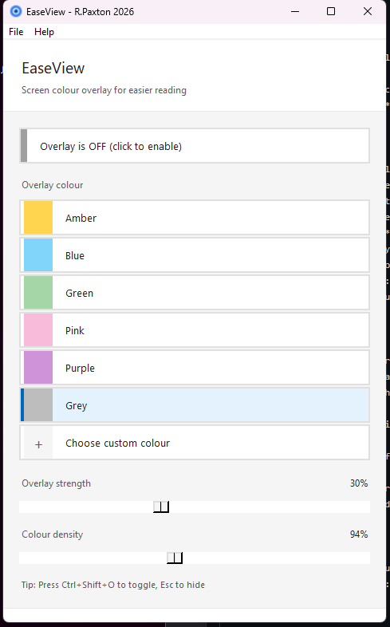

# EaseView

A small Windows app that puts a coloured tint over the screen to help with reading and visual comfort.



It covers every monitor with a click-through overlay you can tweak for strength and density. Sits in the system tray, remembers its settings, copes with monitors being plugged in and unplugged, and supports custom hotkeys.

## Features

- Multi-monitor overlay (recovers automatically when monitors come and go)
- DPI-aware UI (sharp at 100%, 125%, 150%, 200%)
- Preset colours and a custom colour picker, with a recent-colours row
- Opacity and density sliders with quick presets
- System tray icon (state-aware: shows the active colour, dims when off)
- Pause overlay for 10s / 30s / 1 min / 5 min via the tray
- Settings profiles - save / load / export / import
- Schedule (fixed times, including overnight, or sunset-to-sunrise via `astral`)
- Optional global hotkeys (admin needed on Windows; opt-in)
- Light / dark / follow-Windows theme
- Portable mode (drop a `portable.ini` next to the exe)
- Update banner that checks GitHub releases on startup
- Atomic settings writes; corrupt files are backed up and reset

## Install

Grab the latest `EaseView.exe` from [the Releases page](https://github.com/Ropaxyz/EaseView/releases).

Or run from source:

```bash
pip install -r requirements.txt
python screen_overlay.py
```

Optional packages and what they unlock:

| Package | Why |
|---|---|
| `pywin32` | Better monitor info, Windows startup registry, dark mode |
| `requests` | Update checks |
| `keyboard` | Global system-wide hotkeys (needs admin) |
| `astral` | Sunset / sunrise scheduling |

`pystray` and `Pillow` are required (tray icon).

## Usage

```
python screen_overlay.py
python screen_overlay.py --minimized
python screen_overlay.py --version
```

## Keyboard shortcuts (in-window)

| Shortcut | Action |
|---|---|
| `Ctrl+Shift+O` | Toggle overlay |
| `Ctrl+Shift+↑ / ↓` | Strength up / down |
| `Ctrl+Shift+→ / ←` | Density up / down |
| `Esc` | Hide overlay |
| `Tab` / `Enter` / `Space` | Navigate / activate |

These work whenever the EaseView window is focused. **Global** hotkeys (active while EaseView is in the tray) are off by default - enable them in `Settings → Hotkey settings…`. The `keyboard` package needs admin on Windows.

## Files

User data lives in `%USERPROFILE%`, or alongside the exe in portable mode:

| File | What it is |
|---|---|
| `.easeview_settings.json` | All saved settings |
| `.easeview.log` | Rotating log |
| `.easeview.lock` | PID lock (fallback) |
| `.easeview_profiles/` | Saved profiles |

If the settings file ever goes bad it's renamed to `.corrupt.<timestamp>.bak` and defaults are used.

## Portable mode

Put a file called `portable.ini` (or `portable.txt`) next to the exe. EaseView will then keep everything in its own folder.

## Build

```
build_windows.bat
```

This installs requirements, runs the tests, and runs PyInstaller via `EaseView.spec`.

## Known issues

- Windows only.
- The `keyboard` package needs admin for global hotkeys.
- Some exclusive-fullscreen DirectX games render on top of the overlay.

## Licence

MIT - see [LICENSE](LICENSE).

Ross Paxton - Ross.paxton@south-ayrshire.gov.uk
